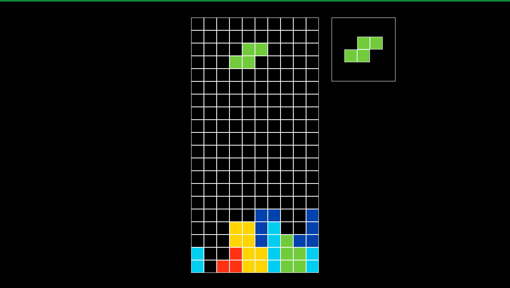

# Simple Pygame Tetris Clone 

Simple Tetris clone developed with Pygame and Python. 
Still WIP.

References used: 
[Tetris Guideline](https://tetris.fandom.com/wiki/Tetris_Guideline)
[SRS](https://tetris.fandom.com/wiki/SRS)

Current progress:

